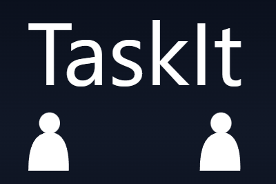
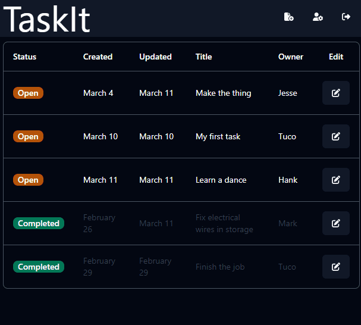

<p style="text-align: center">
  </img>
</p>

<h3 style="text-align: center;">
  A tasking webapp for your team
</h3>

## About

TaskIt is a fullstack web app that lets a team of people assign and create tasks for its members (employees). 

A demo is live here: [TaskIt](https://taskit-bd9e.onrender.com/)

You can login with these credentials to view and create tasks as an employee (access to users and task deletion is not allowed for employees):
```
username: Mark
password: testing123!
```



Features:
- Roles and permissions (Administrator, Manager, Admin)
- Login and Authentication
- Creation, editing, and deletion of tasks

### Why I built this

This project was a way for me to learn multiple technologies and frameworks at once. Completion of this project required me to create a backend repo for the API, that communicates with a database, and a frontend repo in which the user will be directly interacting with. 

It was also my first attempt in creating login authentication that has use of JSON Web Tokens for secure information transmission, and refresh tokens which allow the logged in user to obtain more access tokens without having to relogin everytime an access token expires. Thus the API will only be accessible to users whose accounts are in the database.

 On the frontend side, I also worked on adding features such as prefetching, to reduce load times when switching routes or fetching data.

## How it's built

TaskIt uses ExpressJS and MongoDB for it's API, React JS, Tailwind for styling, and Shadcn UI components for the frontend. Additionally, it uses React Redux for routing and JWT Authentication for Login. 

## How to run locally

***Prerequisites**: Running locally requires the [backend API](https://github.com/JerSabino/taskit-api) to be up and running.* 

Run `npm install` in the project directory to install all dependencies

Once dependencies are installed, run the project with `npm start`, a page will open in your default browser

## What's next for TaskIt

As of now, it's fully functional and I've reached a point in which I am satisfied with what I've learned and am ready to move to the next project. 

However if I were to continue adding features onto this, I do have a list of things I would like to one day implement in the future:
- A revised dashboard
  - Showing a summary of tasks (# of open and completed)
    - For team and individual
  - Notifications for any open assigned tasks
  - A graph showing how number of completed tasks per day over the period of a week/month/year
  - Better styling to fill up the negative space on the dash
- Filtering on the table via the different headers (status, name, owner, date, etc..)
- ComboBox to search by name on the 'assign to' select bar
- Animated components!

## Contact 

If you have any questions regarding this project, or how to run it, you can reach me via my email!

Jeremiah Sabino - jer.lsabino@gmail.com 